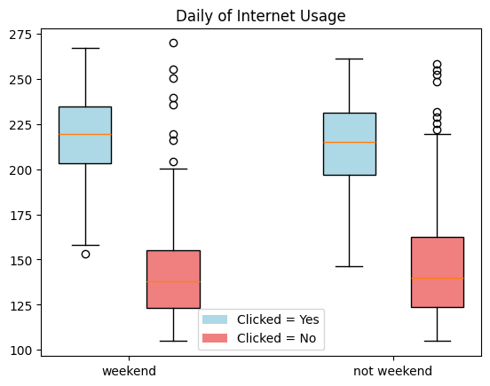
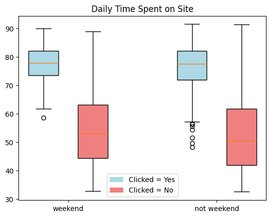
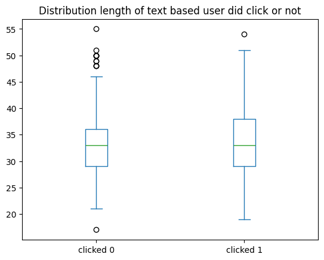
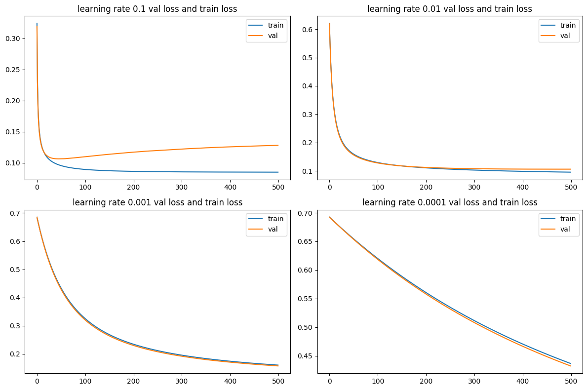
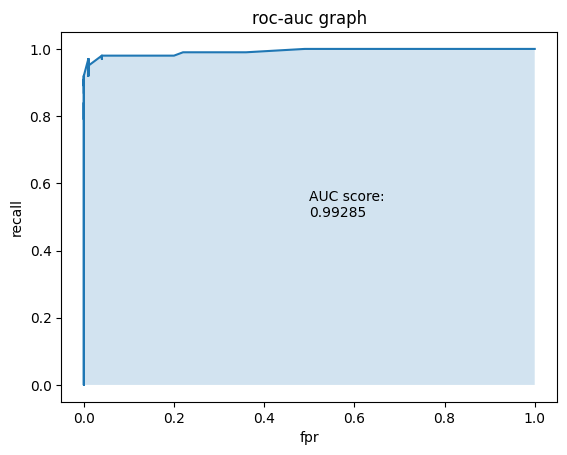
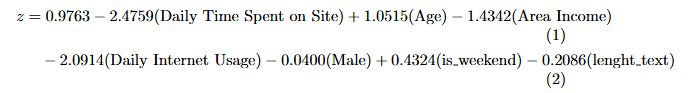

# Classifying whether a user clicked an ad after seeing it on a website

## Goal

When running an advertising campaign, it is important to predict whether a user will click on an advertisement. This helps evaluate the effectiveness of the campaign. In this case, we aim to build a classification model to predict whether a user will click on an ad based on several user-related features.

## Dataset


The source of dataset will be used from

 https://github.com/sakhawat-ahmed/Logistic-Regression-Project/blob/main/advertising.csv


## EDA

### a. Distribution of Daily of usage internet between weekend and not weekend based  on clikced or not



Based on the boxplots, users who clicked the advertisement generally exhibit higher daily internet usage than those who did not click. In contrast, the distributions of daily internet usage during weekends and non-weekends are very similar within each click category, suggesting that weekend status has little influence on internet usage. Overall, click behavior appears to be more strongly associated with daily internet usage than whether the observation occurred on a weekend or a non-weekend.


### b. Daily spent on the website between weekend and not weekend based clicked or not clicked



Based on boxplots:
- Indicates that there're difference in daily time spent on site between user clicked and did not clicked.
- But, seems status of day (weekend or not weekend) is little influence for daily time spent on site

### c. Influence of Length of advertisment based on decision clicked or not



Based on the boxplot, the distribution of length of advertisment between users click or did not click seems similar, it show that both median have similar value. So the lentgth of advertisment is little influence on decision user click or not

## Build Classification Model

### Features

For model we select following feature :

1. Daily time spend on site
2. Age
3. Area income
4. Daily Internet Usage
5. Gender
6. Is_weekend (new column from transforming process)
7. Length_text (new column)

### Choose Model

In this model because the target variable is binary class label we use Logistic Regression

### Step

To build the model, we first split the dataset into training, validation, and test sets.  
After that, we scale the numerical features using the scaler fitted on the training data.  
Then, we train the logistic regression model using Mini-Batch Gradient Descent.  
Finally, we evaluate the trained model using the test set

## Training Model

```python
import numpy as np


class LogisticRegression:
  def __init__(self,x_train,x_val,y_train,y_val):
    self.x_train = x_train
    self.x_val = x_val
    self.y_train = y_train
    self.y_val = y_val


  def predict(self,theta,x):
    y_pred = x @ theta.T

    prob_y_pred = 1/(1+np.exp(-y_pred))

    return prob_y_pred

  def loss(self,y_true,y_pred):
    # m
    m = len(y_true)
    # avoid inf when log(0)
    y_pred = np.clip(y_pred,1e-15,1-(1e-15))
    # reshape
    y_true = np.array(y_true).reshape(-1,1)
    loss = (-1/m)*np.sum(y_true*np.log(y_pred)+(1-y_true)*np.log(1-y_pred))

    return loss

  def mini_batch_gradient_descent(self,learning_rate,batch_size=32,epoch = 7):
    # add intercept
    size_train = self.x_train.shape[0]
    size_val = self.x_val.shape[0]
    X_train_base = np.c_[np.ones((size_train,1)),self.x_train.to_numpy()]
    X_val_arr = np.c_[np.ones((size_val,1)),self.x_val.to_numpy()]
    y_train_base = self.y_train.to_numpy()

    # init theta
    theta = np.zeros((1,X_train_base.shape[1]))

    lr = learning_rate


    epoch_loss_train = []
    epoch_loss_val = []
    for i in range(epoch):

      # shuffle train
      idx_shuffle = np.random.permutation(X_train_base.shape[0])
      X_train_arr = X_train_base[idx_shuffle]
      y_train_arr = y_train_base[idx_shuffle]

      for j in range(0,X_train_arr.shape[0],batch_size):

        # get data batch
        X_batch_arr = X_train_arr[j:j+batch_size]
        y_batch_arr = y_train_arr[j:j+batch_size].reshape(-1,1)

        y_predict_train_arr = self.predict(theta,X_batch_arr)

        # error

        error = y_predict_train_arr -  y_batch_arr

        # gradient
        gradient = error.T @ X_batch_arr  / len(y_batch_arr)

        # update theta
        theta = theta - lr * gradient

      # train and val per epoch

      y_full_pred_train = self.predict(theta,X_train_arr)
      y_full_pred_val = self.predict(theta,X_val_arr)

      loss_train = self.loss(y_train_arr,y_full_pred_train)
      loss_val = self.loss(self.y_val,y_full_pred_val)

      epoch_loss_train.append(loss_train)
      epoch_loss_val.append(loss_val)

    return theta,epoch_loss_train,epoch_loss_val

```



Based on the picture with number of epoch 500 and using different learning rate (0.1,0.01,0.001, and 0.0001) seems learning rate 0.01 become the best performance for training the logistic regression model in this dataset giving the best stability between validation and training (stay close each other).

## Evaluation metrics

### Confusion Matrix

| | Predicted 1 | Predicted 0|
|---|----|---|
|true 1 | 95 | 5|
|true 0| 0 | 100|

### Acurracy

From confusion matrix we can measure accuracy of classification the accuracy of the model is 97.5 %

### Precision

precision is 100.0 %

### Recall

recall is 95.0 %


### F1-Score

Metric used to combine precision and recall into one value, measure balance between precision and recall, f1-score : 97.43589743589743

### ROC-AUC



AUC = 0.99235, indicating excellent discrimination capability. The model can effectively separate class 1 from class 0 with very high recall and a very low false positive rate across different threshold values.


## Conclusion 

The conclusion with training epoch 500 and learning rate 0.01 and 7 features create better generalization rather than other hyperparameter. And then this approach are evaluated by metric produce high auc score (0.99235) The model can effectively separate class 1 from class 0 with very high recall and a very low false positive rate. So the the form of model is 

